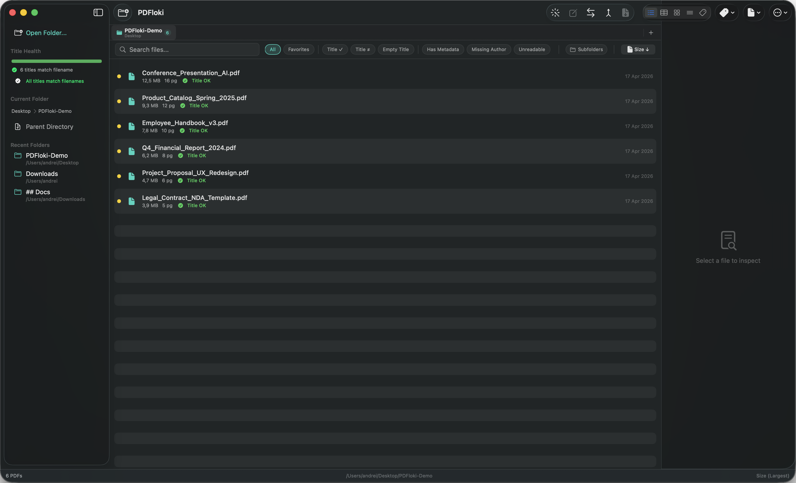
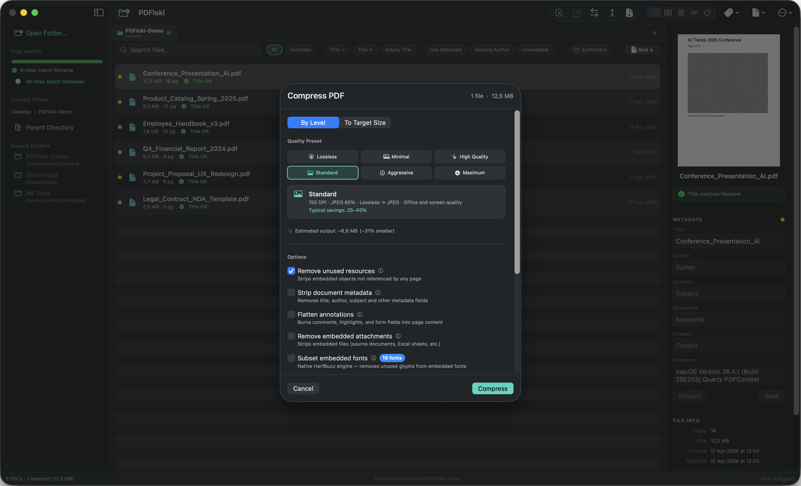
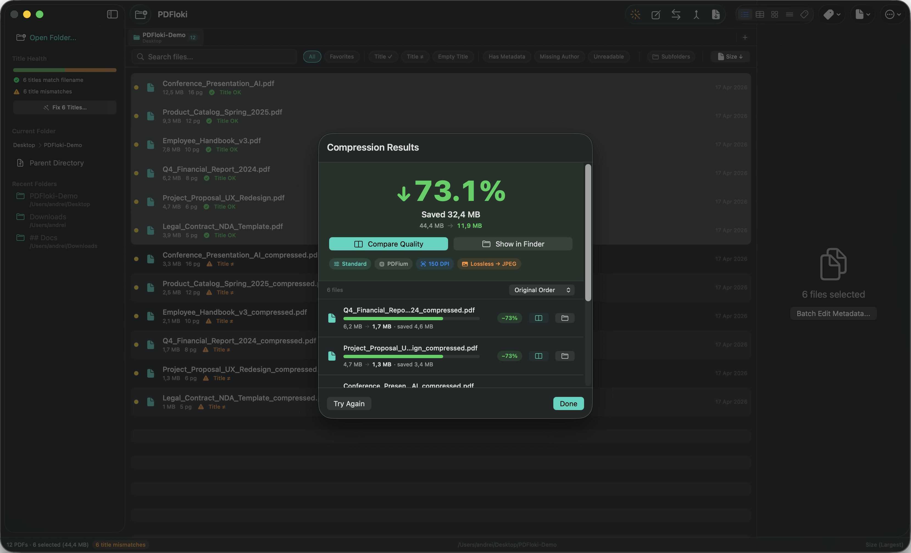

# Screenshot Integration Plan

Screenshots are in: `Desktop/New Folder With Items/`

## Step 1 — Copy & rename files

```bash
mkdir -p assets/screenshots

cp "~/Desktop/New Folder With Items/CleanShot 2026-04-17 at 12.11.08@2x.png" assets/screenshots/library-view.png
cp "~/Desktop/New Folder With Items/CleanShot 2026-04-17 at 12.08.59@2x.png" assets/screenshots/compress-sheet.png
cp "~/Desktop/New Folder With Items/CleanShot 2026-04-17 at 12.09.40@2x.png" assets/screenshots/compress-results.png
cp "~/Desktop/New Folder With Items/CleanShot 2026-04-17 at 11.12.31@2x.png" assets/screenshots/welcome.png
```

---

## Step 2 — App Mockup Slider (index.html ~line 2141)

The slider has 3 slides made entirely of CSS fake UI. Replace each `<div class="app-window">` block with a real screenshot.

**Slide 1** — Library view (currently "PDFloki — Documents")
Replace the entire `<div class="app-window">...</div>` block with:
```html
<div class="app-window app-window--screenshot">
  
</div>
```

**Slide 2** — Metadata editor (keep or replace with another screenshot if available)

**Slide 3** — Compression sheet (currently CSS compression mockup)
Replace with:
```html
<div class="app-window app-window--screenshot">
  
</div>
```

Add this CSS for the screenshot variant:
```css
.app-window--screenshot {
  padding: 0;
  overflow: hidden;
  border-radius: 10px;
}
.app-window--screenshot img {
  width: 100%;
  height: auto;
  display: block;
  border-radius: 10px;
}
```

---

## Step 3 — Compression Spotlight section (~line 2761)

This section describes the compression engine but has no visual proof. Add the batch results screenshot above or below the compression levels table.

Find the section opening:
```html
<!-- Compression spotlight -->
```

Add after the intro paragraph:
```html
<div class="compression-proof">
  
  <p class="compression-proof-caption">6 files · 73.1% average reduction · 32.4 MB saved</p>
</div>
```

CSS:
```css
.compression-proof {
  margin: 2.5rem auto;
  max-width: 780px;
  text-align: center;
}
.compression-proof img {
  width: 100%;
  height: auto;
  border-radius: 12px;
  box-shadow: 0 8px 40px rgba(0,0,0,0.45);
}
.compression-proof-caption {
  margin-top: 0.75rem;
  font-size: 0.85rem;
  color: var(--gray-400, #888);
}
```

---

## Step 4 — Hero section (~line 2086)

Currently only shows the app icon. The batch results screenshot (`compress-results.png`) is your strongest conversion asset — consider adding it below the download button as a "hero visual":

```html
<div class="hero-screenshot">
  
</div>
```

CSS:
```css
.hero-screenshot {
  margin-top: 2.5rem;
  max-width: 860px;
  margin-left: auto;
  margin-right: auto;
}
.hero-screenshot img {
  width: 100%;
  height: auto;
  border-radius: 14px;
  box-shadow: 0 12px 60px rgba(0,0,0,0.5);
}
```

---

## Priority order

1. **Slider Slide 1** → `library-view.png` (biggest visual upgrade, above the fold)
2. **Compression Spotlight** → `compress-results.png` (proof it works, drives conversions)
3. **Slider Slide 3** → `compress-sheet.png` (shows the UI before results)
4. **Hero** → `compress-results.png` (optional, only if hero feels too sparse)
